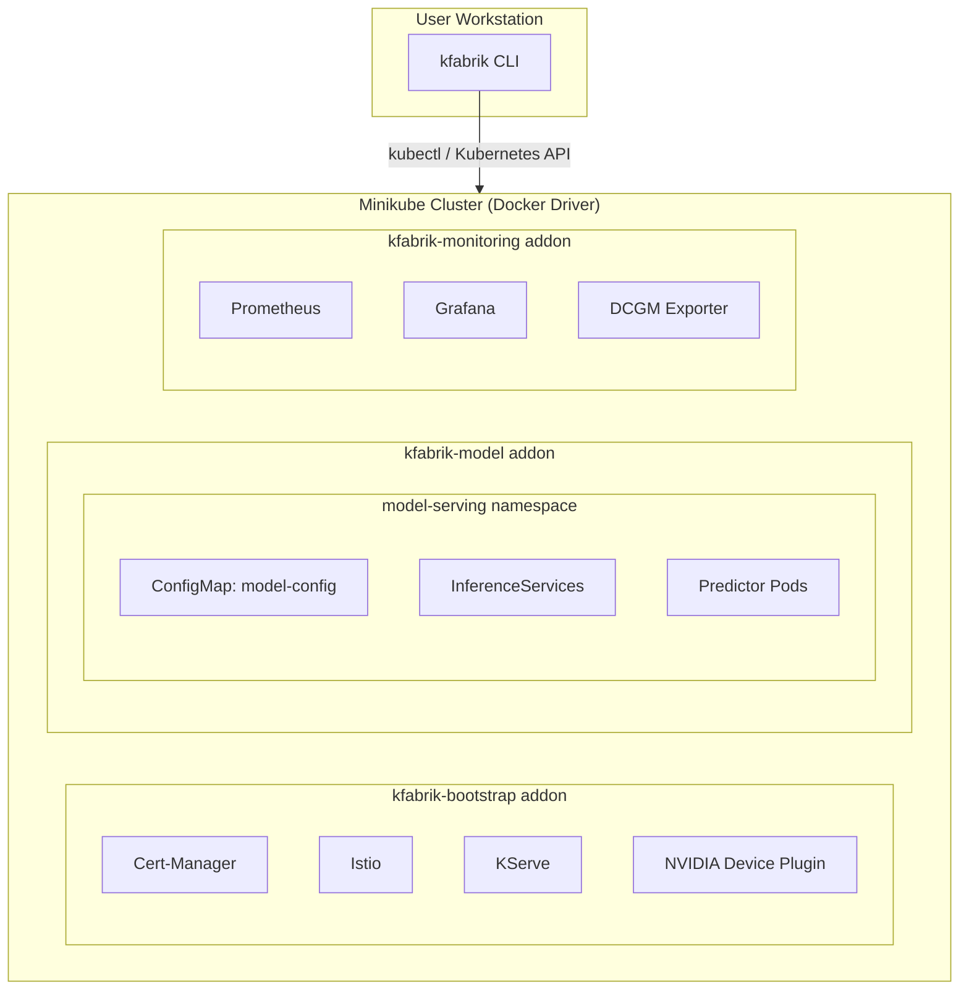
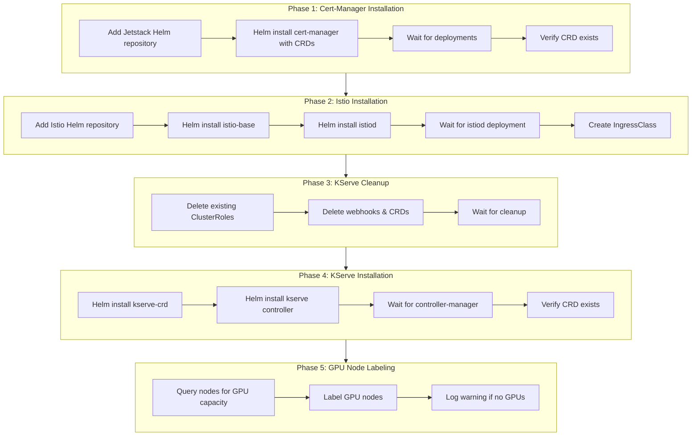
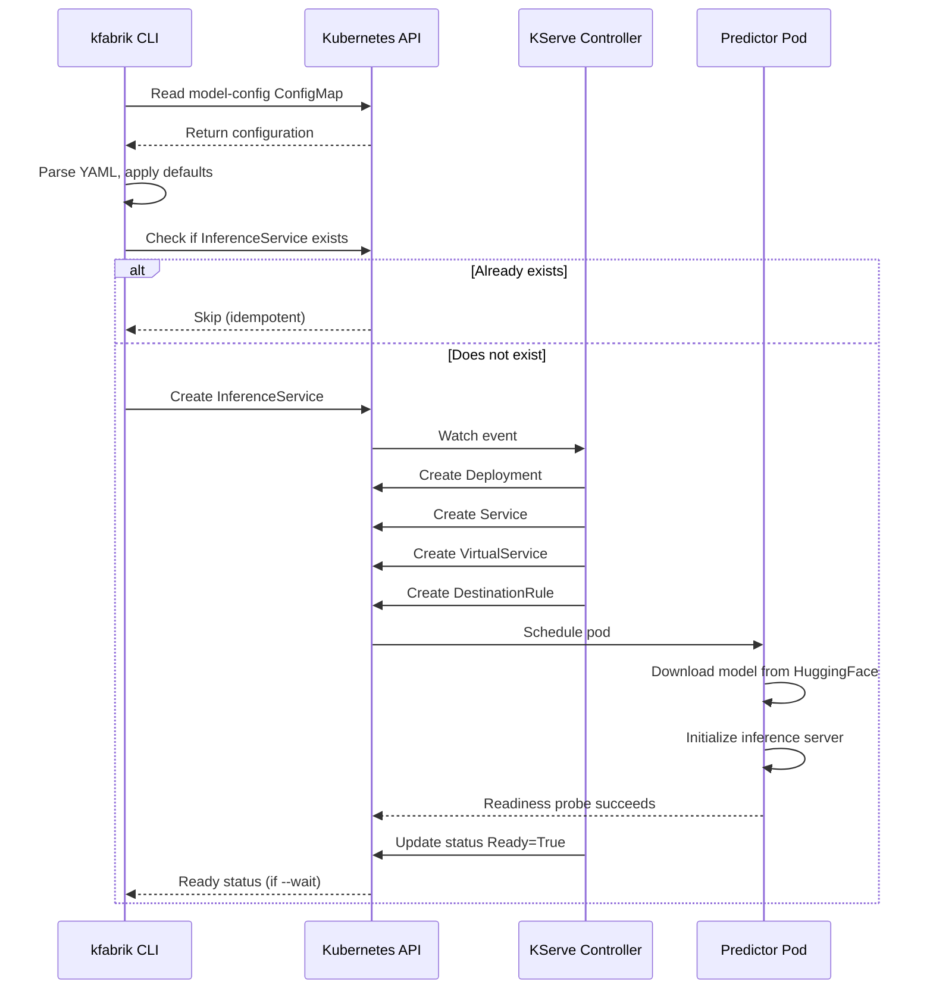
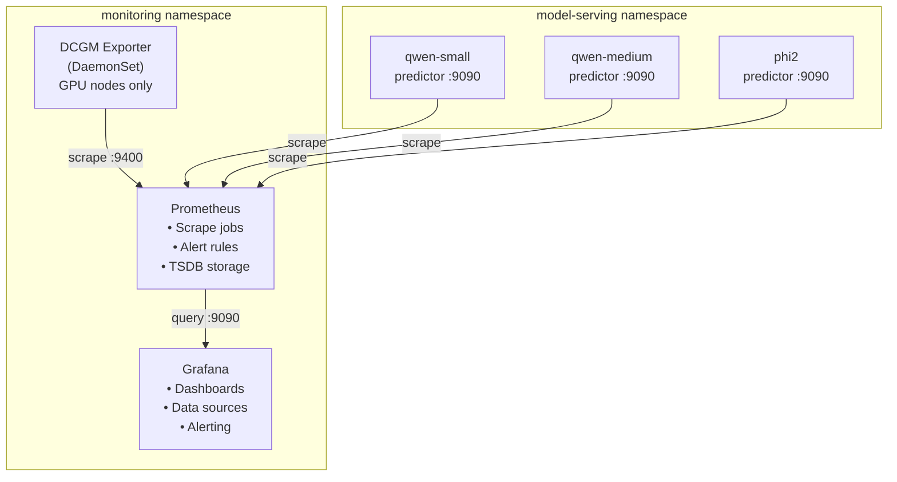

# Architecture

This document describes the architecture, component interactions, and operational characteristics of the KFabrik platform.

## Overview

KFabrik consists of four primary components that work together to provide a complete ML inference platform:



## Component Responsibilities

### kfabrik CLI

Provides a command-line interface for deploying models, querying inference endpoints, and managing the model lifecycle. The CLI communicates with the Kubernetes API to create InferenceService resources and uses kubectl port-forwarding to access inference endpoints.

**Kubernetes Client Architecture:**

- **Typed Clientset** (`kubernetes.Clientset`) for standard Kubernetes resources (ConfigMaps, Pods, Services)
- **Dynamic Client** (`dynamic.Interface`) for custom resources (InferenceServices)

### kfabrik-bootstrap Addon

Installs the foundational infrastructure required for model serving:

- **Cert-Manager** for TLS certificate management
- **Istio** for service mesh routing
- **KServe** for model lifecycle management
- **NVIDIA Device Plugin** for GPU resource scheduling

The addon uses a Kubernetes Job to orchestrate Helm-based installations in dependency order.

### kfabrik-model Addon

Creates the model-serving namespace and deploys a ConfigMap containing pre-configured model definitions. These definitions specify HuggingFace model URIs, resource requirements, and inference server parameters optimized for 6GB VRAM GPUs.

### kfabrik-monitoring Addon

Deploys the observability stack:

- **Prometheus** for metrics collection
- **Grafana** for visualization
- **DCGM Exporter** for GPU-specific metrics

Prometheus is pre-configured to scrape KServe inference metrics and DCGM GPU metrics.

## Bootstrap Installation Sequence

The bootstrap addon installs components through a sequenced process with explicit health checks:



## Design Decisions

### Why RawDeployment Mode?

KServe supports two deployment modes: Serverless (using Knative) and RawDeployment (using standard Kubernetes Deployments). KFabrik currently uses RawDeployment for simplicity—it's easier to set up, debug, and operate for local development.

Knative support is planned for a future release.

### Why Sequential Installation?

Parallel installation would be faster but creates race conditions. Istio requires Cert-Manager for TLS certificates. KServe requires Istio for ingress routing. The sequential approach adds approximately 2 minutes to installation time but eliminates entire categories of failure modes.

### Why Cleanup Before KServe Installation?

KServe's webhook configurations and CRDs can become orphaned when previous installations fail mid-process. The cleanup phase ensures idempotent behavior: running the installer multiple times produces the same result.

## Model Deployment Flow

When a user runs `kfabrik deploy --models qwen-small`:



## InferenceService Specification

The CLI generates InferenceService resources with the following structure:

```yaml
apiVersion: serving.kserve.io/v1beta1
kind: InferenceService
metadata:
  name: qwen-small
  namespace: model-serving
spec:
  predictor:
    model:
      modelFormat:
        name: huggingface
      storageUri: hf://Qwen/Qwen2.5-0.5B-Instruct
      resources:
        requests:
          cpu: "1"
          memory: "2Gi"
          nvidia.com/gpu: "1"
        limits:
          cpu: "2"
          memory: "4Gi"
          nvidia.com/gpu: "1"
      env:
        - name: HF_MODEL_ID
          value: "Qwen/Qwen2.5-0.5B-Instruct"
        - name: MAX_MODEL_LEN
          value: "2048"
        - name: DTYPE
          value: "float16"
```

## Monitoring Architecture



### Prometheus Scrape Jobs

| Scrape Job | Targets | Metrics |
|------------|---------|---------|
| prometheus | Self (localhost:9090) | Prometheus internal metrics |
| kubernetes-apiservers | API server | API request latency, etcd metrics |
| kubernetes-nodes | All nodes | Node CPU, memory, disk |
| kubernetes-nodes-cadvisor | All nodes | Container resource usage |
| kubernetes-service-endpoints | Annotated services | Custom service metrics |
| kubernetes-pods | Annotated pods | Custom pod metrics |
| dcgm-exporter | GPU node pods | GPU utilization, temperature, memory |
| kserve-inferenceservices | Model predictor pods | Inference latency, throughput |

### GPU Metrics (DCGM Exporter)

| Metric | Type | Description |
|--------|------|-------------|
| DCGM_FI_DEV_GPU_UTIL | gauge | GPU utilization percentage |
| DCGM_FI_DEV_MEM_COPY_UTIL | gauge | Memory copy engine utilization |
| DCGM_FI_DEV_FB_FREE | gauge | Free framebuffer memory (MiB) |
| DCGM_FI_DEV_FB_USED | gauge | Used framebuffer memory (MiB) |
| DCGM_FI_DEV_FB_TOTAL | gauge | Total framebuffer memory (MiB) |
| DCGM_FI_DEV_GPU_TEMP | gauge | GPU temperature (Celsius) |
| DCGM_FI_DEV_MEMORY_TEMP | gauge | Memory temperature (Celsius) |
| DCGM_FI_DEV_POWER_USAGE | gauge | Power consumption (Watts) |

## Security Considerations

### Privilege Requirements

The kfabrik-bootstrap installer Job requires cluster-admin privileges for:

- Creating CustomResourceDefinitions (cluster-scoped)
- Creating ClusterRoles and ClusterRoleBindings
- Creating ValidatingWebhookConfigurations
- Installing Helm charts that modify cluster-wide resources

**Mitigations:**

- Installer Job has TTL of 300 seconds (auto-deleted after completion)
- ServiceAccount is scoped to kserve namespace
- Installer runs once during addon enablement, not continuously

### Network Exposure

By default, KFabrik does not expose services outside the cluster. All access occurs through:

- `kubectl port-forward` for CLI queries
- `minikube service` for Grafana/Prometheus dashboards

## Dependencies

### External Dependencies

| Component | Source | Purpose |
|-----------|--------|---------|
| Cert-Manager | Jetstack Helm | TLS certificate management |
| Istio | Istio Helm | Service mesh, ingress |
| KServe | KServe OCI | Model serving platform |
| NVIDIA Device Plugin | NVIDIA | GPU resource scheduling |
| Prometheus | Docker Hub | Metrics collection |
| Grafana | Docker Hub | Visualization |
| DCGM Exporter | NVIDIA | GPU metrics |

### Runtime Dependencies

| Dependency | Required By | Purpose |
|------------|-------------|---------|
| minikube | kfabrik CLI | Cluster management |
| kubectl | kfabrik CLI | Port-forwarding, API access |
| Docker | minikube | Container runtime |
| NVIDIA Driver | Host | GPU access |
| NVIDIA Container Toolkit | minikube | GPU passthrough |

## Resource Requirements

### Default Resource Requirements

| Component | CPU Request | CPU Limit | Memory Request | Memory Limit |
|-----------|-------------|-----------|----------------|--------------|
| KServe Controller | 100m | 500m | 256Mi | 512Mi |
| Prometheus | 250m | 500m | 512Mi | 1Gi |
| Grafana | 100m | 200m | 256Mi | 512Mi |
| DCGM Exporter | 100m | 500m | 512Mi | 1Gi |
| Model Predictor (small) | 1 | 2 | 2Gi | 4Gi |
| Model Predictor (medium) | 2 | 4 | 6Gi | 10Gi |

### Port Assignments

| Service | Port | Protocol | Purpose |
|---------|------|----------|---------|
| Prometheus | 9090 | HTTP | Metrics API, Web UI |
| Grafana | 3000 | HTTP | Dashboard UI |
| DCGM Exporter | 9400 | HTTP | GPU metrics endpoint |
| Model Predictor | 80 | HTTP | Inference API |
| Model Predictor Metrics | 9090 | HTTP | Prometheus metrics |
